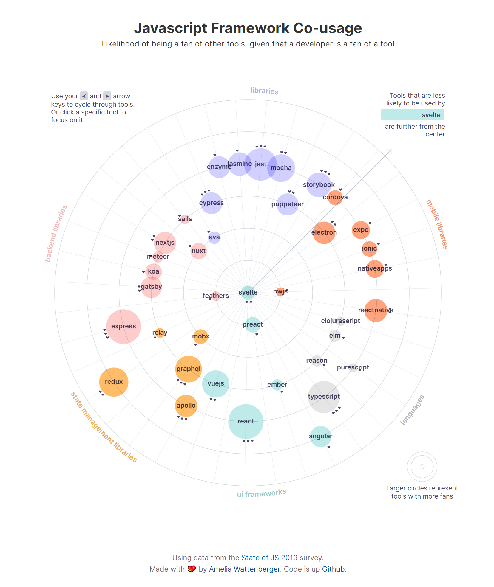

# Javascript Framework Co-usage

This is a visualization of how likely developers are to be fans of other JS tools, given that they're a fan of a specific tool.

Play with it live at [js-tools.netlify.com](https://js-tools.netlify.com/)

Mainly an excuse for [Amelia Wattenberger](http://wattenberger.com) to play around with [Svelte](https://svelte.dev/).

Feel free to poke around the codebase, and ask specific questions in [Twitter](http://twitter.com/wattenberger).



## To run locally

```bash
yarn install
yarn dev
```
